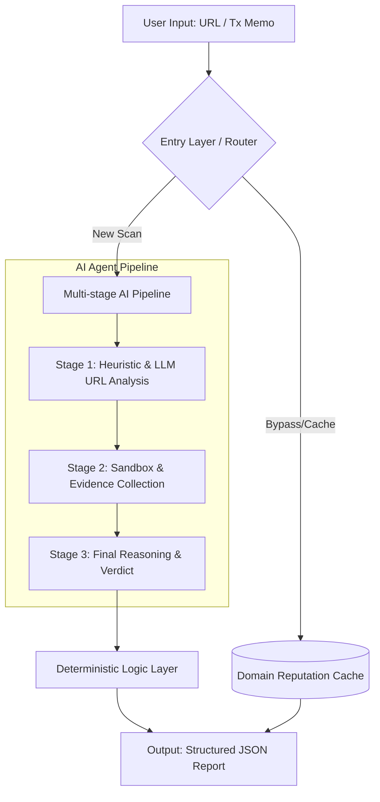

+++
title = "SafeClick – Phishing Detection System"
summary = "A production-grade zero-day phishing detection engine that combines probabilistic AI with deterministic security logic. Now live at safeclick.dev."
portfolio_keywords = "Zero-day Phishing Detection · Deterministic Security Logic · LLM Orchestration · Security AI"
weight = 10
mermaid = true
live_url = "https://safeclick.dev"
+++

**Deployed and live.** Try it: [https://safeclick.dev/](https://safeclick.dev/) — serving production traffic with deterministic validation and human-in-the-loop–ready structured reports.

### Demo

### 🏗️ System Architecture

### Problem

Traditional ML or LLM-only approaches fail in phishing detection due to sparse signals, zero-day variants, and unreliable external evidence. Users need a security-focused system that operates under real-world constraints. SafeClick bridges the gap between unreliable AI outputs and mission-critical security by applying a **zero-trust** stance: LLM outputs are never trusted until they pass explicit validation boundaries and deterministic scoring.

### Approach

- Designed a multi-stage phishing detection pipeline for URLs with constrained LLM reasoning and deterministic risk scoring
- Implemented deterministic security logic to ensure stable verdict behavior in non-deterministic model environments
- Treated the LLM as a probabilistic component behind explicit validation boundaries, caching/deduplication, and fallback logic
- Engineered for reliability under degraded dependencies with clear failure modes and cost control
- Evolved a hackathon prototype toward a production-ready security service with system boundaries and observability

### Web3 & Blockchain Security

The system treats **transaction memo phishing** as a first-class threat vector. Attackers send micro-transactions (e.g. 0.000001 tokens) with malicious URLs embedded in the memo field, targeting wallet users who click without verifying. SafeClick’s pipeline treats the memo as an input vector: extracted URLs are fed into the same AI-driven URL scanner and deterministic logic layer, so Web3 users get the same structured risk report whether they paste a URL or submit a transaction memo. This bridges traditional web phishing and on-chain social engineering in one pipeline.

### Engineering Highlights

| Feature | Implementation | Benefit |
|--------|----------------|--------|
| **Deduplication** | Firestore Transaction-based ScanJobs | Prevented 40% redundant LLM calls |
| **Caching** | Two-tier: Bloom Filter + TTL Firestore | Reduced latency by ~200ms for known domains |
| **Reliability** | Pydantic Schema Validation | 0% output format error rate |
| **Testing** | 38+ Unit & Integration Tests | Ensured safe fail-over for insufficient evidence |

### Results

- **Deployed at safeclick.dev** — serving production traffic with structured risk reports for URLs and transaction memos
- Won 1st Place and Most Secure Project Award (Hofstra-Pensar Hackathon)
- Reduced nondeterminism in decision outputs through deterministic scoring and validation boundaries; 0% output-format error rate in production
- Improved resilience to partial failures via explicit fallbacks and pipeline-stage fault handling

### Tech Stack

Python, Pydantic, LLM orchestration, multi-stage URL analysis, caching, deduplication
